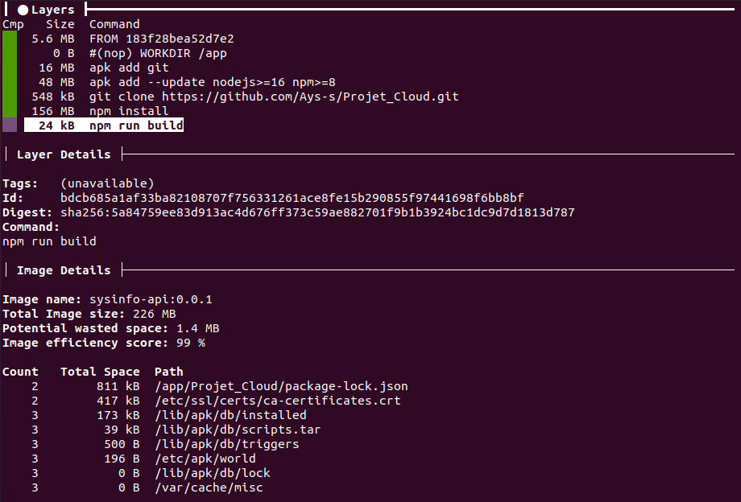
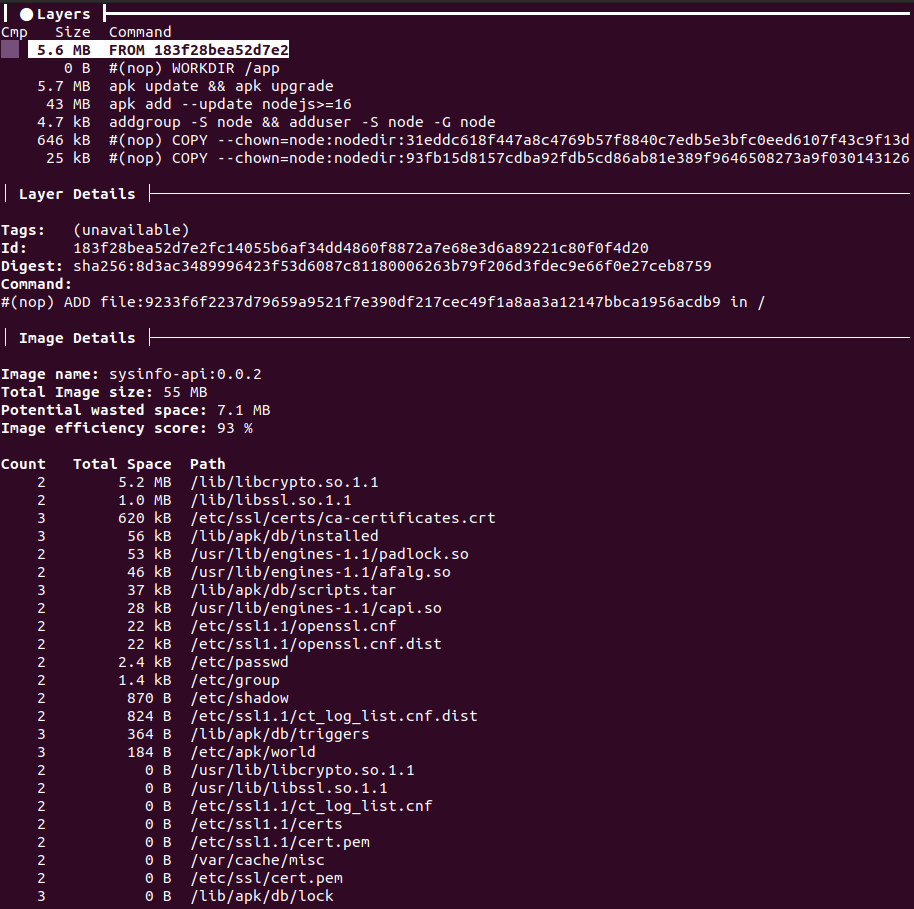

# Projet - Programmer le Cloud

Ayrwan GUILLERMO - ENSTA Bretagne

--------

Lien vers le répo : (https://github.com/Ays-s/Projet_Cloud)

## TD 1 : une application Node.js

### 2

Le fichier `package.json` est le fichier de gestion du package qui gère les dépendances, les scripts de run et le point d'entrer du package.

Le fichier `package-lock.json` permet d'indexer les packets installé avec la version précise de ceux-ci, afin d'être sur d'avoir les mêmes versions de modules.

### 3

Cela ajoute une dépendance à `systeminformation`. `devDependencies` permet d'avoir des dépendances uniquement sur environnement de développement et non celui de production.

### 5

On utilise ce formalisme pour pouvoir avoir un point d'entrer spécifique à l'API puis à chaque version de celle-ci.

### 6 
On écrit ce jeu de test pour pouvoir mettre en place l'intégration continue. Afin que celle-ci soit faite il faut qu'un test soit réussi.


## TD2 : conteneurisation avec Docker
### 4

Le flag `-p` permet une redirection de port entre le docker et la machine qui exécuter.  
Le flag `-m` permet de définir la mémoire alloué au docker.
Le flag `--cpus` indique le nombre de cpu alloué à exécution du docker.  

### 5


La taille du container est très grande : Total Image size: 226 MB.  
Elle contient des utilitaires ou des parties de codes utiles uniquement pour le build. On pourrait réduire la taille de l'image en enlevant ces utilitaires.

### 6


La taille du container est beaucoup plus petite : Total Image size: 55 MB 

Le delta est de 171MB soit une baisse de 75%. 

### 8
La commande est : 
``` shell
docker login
docker pull ayss/sysinfo-api:0.0.2
```


## TD3 : CI/CD avec GitHub
### 3
On test sont fonctionnement directement sir les `github actions`. On voit dans l'onglet `actions` le build de notre application et les erreurs s'il y en a.

### 4
Il aurait été plus simple de découper la partie server du reste de l'application. Les tests auraient été plus simples à réaliser.


## TD4 : déploiement sur PaaS avec Heroku 
### 3
Le *Process type* est le type d'application qui va être déployé. On utilise donc `web` car on déploie un application web.

### 4
Bien que l'application build, on ne peut pas accéder à son url. Le port est assigné de façon dynamique et une variable d'environnement l'indique. Il  faut donc ce servir de cette variable pour indiquer le port de notre application.

### 5
On peut l'associer au point 7 : Associations de ports.

### 6

Avec notre application on retrouve les information de la machine.
C'est une machine très puissante notamment avec un processeur Intel Xeon Platinum 8259CL.
On remarque que notre application n'est pas exécuter dans une VM car sinon seul les infos de la VM seraient visibles.

### 7 
Le déploiement automatique est disponible à : (https://dashboard.heroku.com/apps/sysinfo-api-ayss)


## Résultat final :
